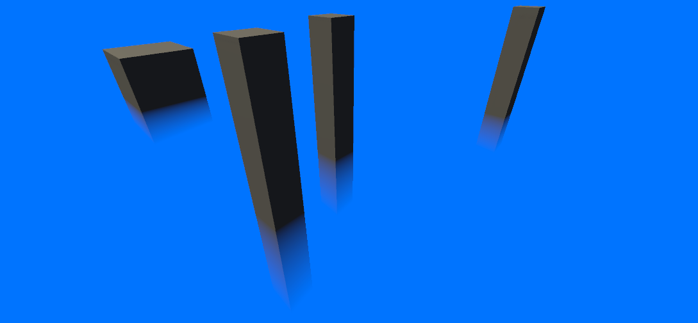

# Surface Fog

**Surface Fog** is a study case project that shows how to achieve a fog effect that involves specific surfaces in the scene.

## Requirements

- Universal Rendering Pipeline

- Unity 2019.3.0a12+

## Get Started

- Set **Rendering Path** in your Universal Renderer Data settings to **Deferred**

    --or--

    Set the **Depth Texture** option to **On** for your camera (or set it globally in your pipeline settings asset).

- Create a material that uses the **Surface Fog** shader and apply it to a mesh.

All regular geometry that falls through this mash will fade according to the material settings.

This is useful to create a fog at the bottom of an environment, such as a room or a landscape.

Check the **FogExample** scene for a reference.

### Note

This is not a volumetric fog effect, so it works only when the camera is above the mesh that uses the fog, not when inside it.

## Limitations
**Surface Fog** doesn't work with orthographic cameras and oblique frustrums.

## Performance Considerations
The **Surface Fog** shader does cheap operations. However it relies on the depth texture to work, which takes a full scene draw of ShadowCaster passes to fill it. If you were already using the Depth Texture or you were already working in Deferred Mode, you won't experiment almost any performance drop. Otherwise this new draw cicle will be added, which is a little expansive.

## TODO
- Add compatibility for the Built-in Rendering Pipeline.
